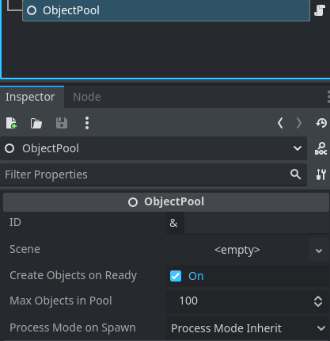

<div align="center">
	

<h3 align="center">Indie Blueprint Pool</h3>

  <p align="center">
  The object pool pattern is a software creational design pattern that uses a set of initialized objects kept ready to use – a "pool" – rather than allocating and destroying them on demand
	<br />
	·
	<a href="https://github.com/ninetailsrabbit/indie-blueprint-pool/issues/new?assignees=ninetailsrabbit&labels=%F0%9F%90%9B+bug&projects=&template=bug_report.md&title=">Report Bug</a>
	·
	<a href="https://github.com/ninetailsrabbit/indie-blueprint-pool/issues/new?assignees=ninetailsrabbit&labels=%E2%AD%90+feature&projects=&template=feature_request.md&title=">Request Features</a>
  </p>
</div>

<br>
<br>

- [📦 Installation](#-installation)
- [ObjectPool 🫧](#objectpool-)
	- [ObjectPoolManager](#objectpoolmanager)
		- [Signals](#signals)
		- [Methods](#methods)
	- [ObjectPool](#objectpool)
	- [ObjectPoolWrapper](#objectpoolwrapper)
	- [How to use](#how-to-use)
		- [Editor](#editor)
		- [GDScript](#gdscript)
		- [Spawn](#spawn)
		- [Kill](#kill)

# 📦 Installation

1. [Download Latest Release](https://github.com/ninetailsrabbit/indie-blueprint-pool/releases/latest)
2. Unpack the `addons/indie-blueprint-pool` folder into your `/addons` folder within the Godot project
3. Enable this addon within the Godot settings: `Project > Project Settings > Plugins`

To better understand what branch to choose from for which Godot version, please refer to this table:
|Godot Version|indie-blueprint-pool Branch|indie-blueprint-pool Version|
|---|---|--|
|[](https://godotengine.org/)|`main`|`1.x`|

# ObjectPool 🫧

The object pool pattern is a software creational design pattern that uses a set of initialized objects kept ready to use – a "pool" – rather than allocating and destroying them on demand.

If you need to instantiate many nodes in your game and you find that performance suffers, this is a first step to improve it.

The `ObjectPool` node allows with a small configuration to have a number of scenes available. These nodes are not deleted, they are hidden and left in a disabled process waiting to be activated again.

## ObjectPoolManager

The `ObjectPoolManager` autoload centralise all pools in your game to be accessed and used at any time without actually having them to be in the scene tree.

### Signals

```swift
func added_pool(pool: ObjectPool)
func updated_pool(previous_pool: ObjectPool, current: ObjectPool)
func removed_pool(pool: ObjectPool)
```

### Methods

```swift
// Dictionary[StringName, ObjectPool]
var available_pools: Dictionary = {}

func add_pool(id: StringName, pool: ObjectPool, overwrite: bool = false) -> void

func update_pool(id: StringName, new_pool: ObjectPool)

func get_pool(id: StringName) -> ObjectPool

func remove_pool(id: StringName) -> void
```

## ObjectPool

You have access to the objects in any moment from the variables

```swift
var pool: Array[ObjectPoolWrapper] = [] // Objects on wait
var spawned: Array[ObjectPoolWrapper] = [] // Active objects
```

---



- **Id:** The unique identifier for this pool.
- **Scene:** The scene to spawn
- **Create objects on ready:** When enabled, creates the number of objects when `_ready` on the scene tree. When not, you need to call manually the function `create_pool(amount: int)`
- **Max objects in pool:** The maximum instances of the scene available in this pool
- **Process mode on spawn:** Select process mode for the instantiated scene when spawned from pool.

---

## ObjectPoolWrapper

The `ObjectPool` does not work with the original instance but instead use a `ObjectPoolWrapper` when spawning new objects. This is an intermediary to apply the pool operations in the scene instance.

In principle you don't need to manually create the `ObjectPoolWrapper` for each scene yourself, the `ObjectPool` does it for you.

When you no longer need the scene, instead of calling `queue_free` in the node as usual you would use the `kill()` function. This will put the object to sleep and make it disappear from the screen.

If you need to remove this wrapper for some reason, it has a built-in `queue_free` function for that.

```swift
class_name ObjectPoolWrapper extends RefCounted


var pool: ObjectPool
var instance: Node
var sleeping: bool = true


func _init(_pool: ObjectPool) -> void

func kill() -> void

func queue_free() -> void
```

## How to use

### Editor

Add a new `ObjectPool` node to the scene and configure the parameters


### GDScript

You can create a new `ObjectPool` via code using the constructor:

```swift
// The constructor definition
_init(
	id: StringName,
	scene: PackedScene,
	amount: int,
	create_on_ready: bool,
	process_mode_on_spawn: ProcessMode
)

// Example
@export var bullet_scene: PackedScene

var my_pool: ObjectPool = ObjectPool.new(&"bullets", bullet_scene, 100, true, Node.PROCESS_MODE_INHERIT)

// If create_on_ready is false, you need to manually call create_pool() when you want to initialize it
// By default it receives the amount selected in the constructor but you can pass it a new one if you wish.
my_pool.create_pool(100)
```

### Spawn

Note that it will always return a `ObjectPoolWrapper` and not the original instance.

Spawning is very simple:

```swift
func spawn() -> ObjectPoolWrapper:

func spawn_multiple(amount: int) -> Array[ObjectPoolWrapper]

func spawn_all() -> Array[ObjectPoolWrapper]:
```

### Kill

To delete instances the pool has a few methods available to it. Ideally, this method should be called directly from the `ObjectPoolWrapper`. If you want to remove it from memory and the pool use the `free()` methods

```swift
func kill(spawned_object: ObjectPoolWrapper) -> void

func kill_multiple(spawned_objects: Array[ObjectPoolWrapper]) -> void

func kill_all() -> void

//You can kill the object from itself
my_spawned_object.kill()

// ---------------

//Free the object forever
func free_object(spawned_object: ObjectPoolWrapper) -> void

func free_objects(spawned_objects: Array[ObjectPoolWrapper]) -> void

func free_pool() -> void

//You can free the object from itself
my_spawned_object.queue_free()
```
